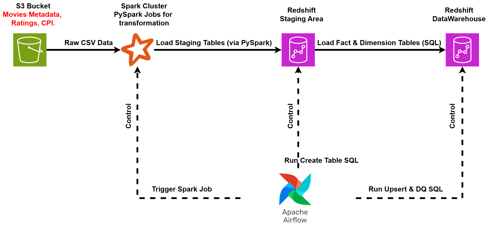
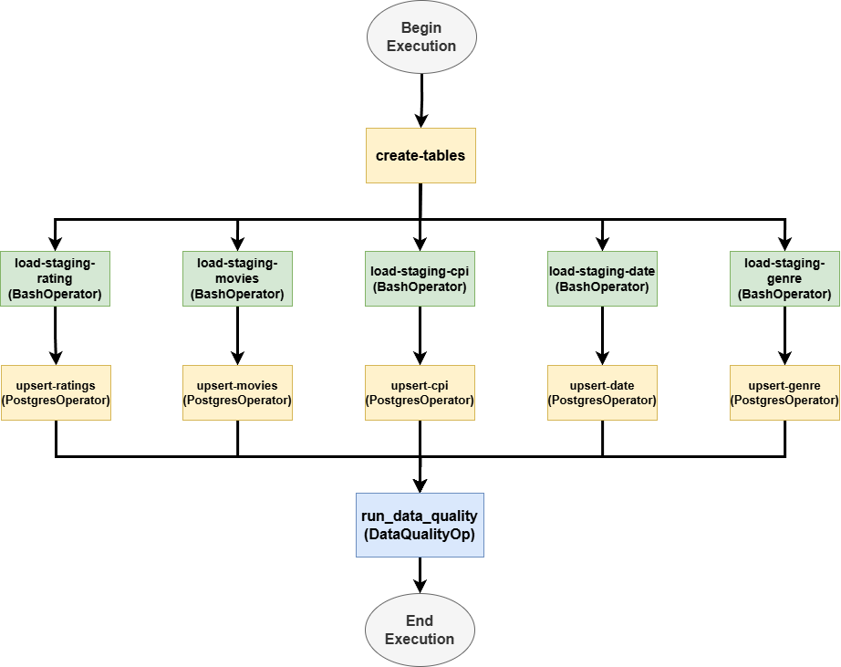
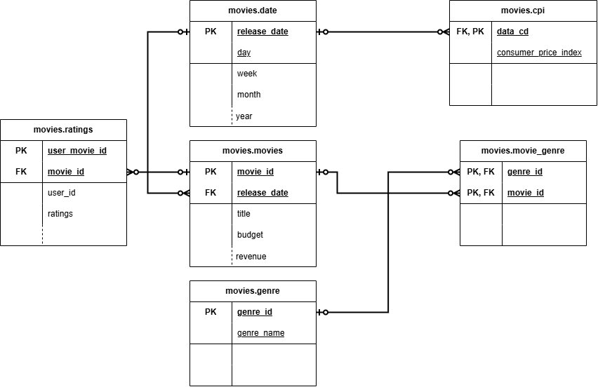

# Movielytics: A Cloud Data Engineering Project



## 1. Problem Statement

Movielytics is an end-to-end data engineering project designed to build a scalable and reliable data warehouse for movie analytics on the AWS cloud. The objective was to create a robust ETL (Extract, Transform, Load) pipeline capable of ingesting raw data from multiple sources, processing it, and loading it into a structured star schema in Amazon Redshift.

This system serves as a practical demonstration of modern data engineering and DevOps principles, including automated workflow orchestration, distributed data processing, containerization, and proactive data quality assurance.

## 2. Tech Stack & Architecture

This project leverages a modern, cloud-native tech stack to build a resilient and scalable data pipeline.

* **Orchestration:** Apache Airflow
* **Data Processing:** Apache Spark (PySpark)
* **Data Lake / Staging:** Amazon S3
* **Data Warehouse:** Amazon Redshift
* **Containerization:** Docker
* **Infrastructure:** AWS, PostgreSQL (for Airflow metadata)
* **Core Language:** Python

### Architecture Overview

The pipeline is designed with a decoupled architecture for maximum flexibility and scalability:

1.  **Data Ingestion:** Raw CSV data (Movies Metadata, Ratings, CPI) is stored in an **Amazon S3** bucket, which serves as the data lake.
2.  **ETL Orchestration:** An **Apache Airflow** DAG, running within a **Docker** container, orchestrates the entire workflow. It schedules and monitors all tasks, from data processing to quality checks.
3.  **Data Transformation:** Airflow triggers distributed **PySpark** jobs to read the raw data from S3, perform cleaning and transformations (e.g., parsing JSON, deriving date dimensions), and load the processed data into staging tables in Amazon Redshift.
4.  **Data Warehousing:** The transformed data is then moved from staging tables to a final, analytics-optimized star schema in **Amazon Redshift**. This step includes "upsert" logic to handle incremental data loads.
5.  **Data Quality:** Automated data quality checks are embedded as a final step in the Airflow DAG to validate the integrity of the data in the Redshift warehouse.



## 3. Key Features & Implementation Details

### Automated ETL Pipeline
The core of the project is a single, comprehensive Airflow DAG (`movies_dwh_dag.py`) that manages the entire pipeline.
* **Parallel Processing:** The DAG is designed to run Spark jobs and SQL upserts in parallel, significantly reducing the overall runtime of the pipeline.
* **Idempotency:** The use of `CREATE TABLE IF NOT EXISTS` and custom upsert SQL scripts ensures that the pipeline can be re-run without creating duplicate data or errors.

### Data Quality Assurance
A custom `DataQualityOperator` was developed as an Airflow plugin to perform critical data validation checks. This operator verifies:
* That tables are not empty after the ETL process.
* That key identifier columns (like `movie_id`, `genre_id`) do not contain any NULL values.
If any check fails, the pipeline fails immediately, preventing corrupted data from being used for analytics.

### Star Schema Data Model
The Redshift data warehouse is modeled using a star schema to optimize for analytical queries. This design features central fact tables (`movies`, `ratings`) connected to dimension tables (`date`, `genre`, `cpi`), allowing for efficient slicing and dicing of data.



## 4. How to Run Locally

This project is containerized using Docker for easy and reproducible setup.

1.  **Prerequisites:**
    * Docker and Docker Compose
    * AWS Account with credentials configured
    * An Amazon Redshift cluster

2.  **Configuration:**
    * Set up your AWS and Redshift connection details in the Airflow UI (Admin -> Connections).
    * Define the `movie_s3_config` variable in the Airflow UI with your S3 bucket details.

3.  **Run the Pipeline:**
    * Start the Airflow environment using the provided `docker-compose-LocalExecutor.yml` file:
        ```bash
        docker-compose -f docker-compose-LocalExecutor.yml up -d
        ```
    * Navigate to `http://localhost:8080` in your browser.
    * Enable and trigger the `movie_dwh_dag` to start the ETL process.
